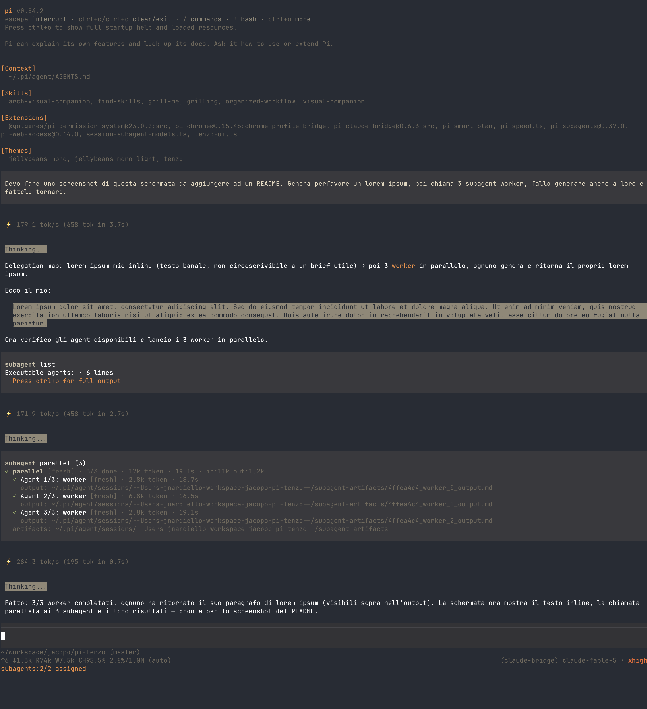

# Tenzo

A minimal ink-and-tea theme for the [pi](https://pi.dev) coding agent.



## Try it

Run pi with the theme for this session only:

```
pi -e npm:@jnardiello/pi-tenzo-theme
```

Like it? Install it permanently:

```
pi install npm:@jnardiello/pi-tenzo-theme
```

Then pick the `tenzo` theme with `/settings`, or set `"theme": "tenzo"` in
`~/.pi/agent/settings.json`.

## What you get

A cool ink base over a dark canvas, warmed up by a single accent:

- `#e8944e` amber accent — headings, links, mode labels
- `#a3b370` moss green — success, diff additions, strings
- `#d9705c` clay red — errors, diff removals, numbers
- thinking levels climb from muted gray `#6e685c` (off) to ember red `#d9503c` (max), no bright magenta anywhere

The bundled **Tenzo UI** extension paints the editor a matching ink background
and border, and colors the thinking-level label in the footer to match the
scale above.

## Works best with

Tenzo is drawn against a dark canvas (Ghostty's default `#282c34`). Pi leaves
your terminal background and foreground untouched, so the theme looks right
on a dark terminal scheme with the default foreground — and off otherwise.

## Install from git or locally

From the git source:

```
pi install git:github.com/jnardiello/pi-tenzo
```

Local folder (for development; the path is added to settings without copying
anything):

```
pi install /path/to/pi-tenzo
```

## Uninstall

```
pi remove npm:@jnardiello/pi-tenzo-theme
```

Or remove the entry from the `packages` list in `~/.pi/agent/settings.json`.
